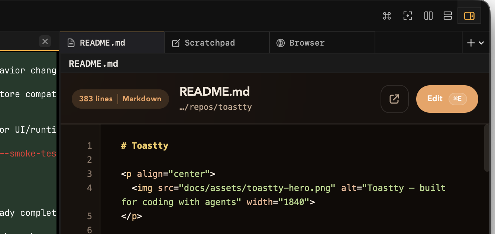

# Toastty

<p align="center">
  
</p>

A native macOS terminal multiplexer built with Swift and powered by the [libghostty](https://ghostty.org) rendering engine.

Toastty builds on the the awesomeness of Ghostty with features that are tuned for working with coding agents: workspaces in vertical tabs, first-class support running agents and getting real-time status updates, and notifications and unread badges when agents are done working.

There are also little features throughout. For example, terminal profiles (to run things like `zmx`, `tmux` or `ssh` on terminal launch), keyboard shortcuts to jump directly to a panel and global font control (resize the font of all terminals at once, useful when switching between external monitors and your laptop for example).

## Features

- **Workspaces in vertical tabs** — Named workspaces as vertical tabs, switch between them with `Cmd+1`–`Cmd+9`, and persist layouts across restarts
- **Running agents** — Launch coding agents directly into terminal panels with automatic real-time sidebar status, unread badges, and desktop notifications
- **Unread badges** — See at a glance when a workspace has a coding agent that is ready for your review or response
- **Split panes** — Divide your workspace horizontally (`Cmd+D`) or vertically (`Cmd+Shift+D`), resize splits (`Cmd+Ctrl+Arrow`), equalize them (`Cmd+Ctrl+Equals`), or zoom a single pane to full view (`Cmd+Shift+F`)
- **Terminal profiles** — Launch named terminal setups such as `zmx`, SSH, or other scripted environments from the menu, with a pill badge in each panel header
- **Font control** — Increase, decrease, or reset terminal font size globally across all terminals at once, with UI changes remembered locally
- **Ghostty terminal rendering** — Embeds Ghostty's GPU-accelerated terminal engine, with Ghostty config compatibility
- **Hot-reload configuration** — Change your config and reload it live from the menu bar
- **Desktop notifications** — Notifications from coding agents and other supported processes
- **Automation socket** — JSON-RPC over Unix socket for scripting and external tool integration ([protocol spec](docs/socket-protocol.md))

## Requirements

- macOS 14.0+
- [Tuist](https://tuist.io) (build system)
- Xcode 16+ with Swift 6.0
- [sv](https://github.com/figelwump/sv) (secret vault for development credentials)
- Ghostty XCFramework (optional — Toastty can build in fallback mode without it)

## Getting Started

### 1. Clone and generate

```bash
git clone https://github.com/figelwump/toastty.git
cd toastty
tuist install
tuist generate
```

`Project.swift` is the source of truth. The generated `toastty.xcworkspace` is not committed, so re-run `tuist generate` after manifest or file-layout changes. Re-run `tuist install` whenever `Tuist/Package.swift` or `Tuist/Package.resolved` changes.

### 2. Install sv

[sv](https://github.com/figelwump/sv) is a lightweight macOS secret vault that stores API keys and credentials in the native Keychain and injects them into processes at runtime. Automation scripts in this repo use `sv exec --` to run commands that need secrets without exposing values in shell history or environment dumps.

```bash
curl -fsSL https://raw.githubusercontent.com/figelwump/sv/main/install.sh | bash
```

After installing, store any required secrets with `sv set <KEY>`. To run a command with secrets injected:

```bash
sv exec -- <command>
```

### 3. Install Ghostty XCFramework (optional)

```bash
GHOSTTY_BUILD_FLAGS="-Demit-macos-app=false -Demit-xcframework=true -Dxcframework-target=universal -Dsentry=false" \
GHOSTTY_XCFRAMEWORK_SOURCE=/path/to/GhosttyKit.xcframework \
  ./scripts/ghostty/install-local-xcframework.sh
```

Set `GHOSTTY_XCFRAMEWORK_VARIANT=release|debug` to control the destination artifact path. The installer also auto-detects a sibling `../ghostty/macos/GhosttyKit.xcframework` checkout when present.
When the source path lives inside a Ghostty git checkout, the installer also records the Ghostty commit and source cleanliness in an ignored sidecar metadata file next to the installed xcframework.

For the recommended upstream Ghostty build command, release note guidance, see [docs/ghostty-integration.md](docs/ghostty-integration.md).

After installing, regenerate:

```bash
tuist install
tuist generate
```

To build without Ghostty:

```bash
TUIST_DISABLE_GHOSTTY=1 tuist generate
```

### 4. Build

```bash
ARCH="$(uname -m)"
xcodebuild -workspace toastty.xcworkspace -scheme ToasttyApp \
  -configuration Debug \
  -destination "platform=macOS,arch=${ARCH}" \
  -derivedDataPath Derived build
```

Or open `toastty.xcworkspace` in Xcode and hit Run.

### 5. Validate

```bash
# Full gate: generate + build + test
./scripts/automation/check.sh

# Smoke UI automation
./scripts/automation/smoke-ui.sh

# Keyboard shortcut tracing
./scripts/automation/shortcut-trace.sh
```

### 6. Build a signed release DMG

The release script expects:
- a clean Toastty git working tree
- a release Ghostty artifact at `Dependencies/GhosttyKit.Release.xcframework`
- Ghostty provenance metadata at `Dependencies/GhosttyKit.Release.metadata.env`
- a local `Developer ID Application` certificate
- notarization credentials injected at runtime
- a Sparkle private key injected at runtime as `TOASTTY_SPARKLE_PRIVATE_KEY`

Use an explicit marketing version plus a monotonically increasing build number:

```bash
sv exec -- env \
  TOASTTY_VERSION=0.1.0 \
  TOASTTY_BUILD_NUMBER=1 \
  TUIST_DEVELOPMENT_TEAM=<TEAM_ID> \
  ./scripts/release/release.sh
```

The script archives the app, exports a signed bundle, creates a plain drag-to-install DMG, notarizes it, staples it, and writes outputs under `artifacts/release/`.
It also snapshots release provenance into the release directory:
- `release-metadata.env` with the exact Toastty commit that was built
- `ghostty-metadata.env` with the embedded Ghostty commit and build flags
- `sparkle-metadata.env` with the feed URL, public key, DMG signature, and enclosure metadata needed for appcast publication

The script also records the canonical `artifacts/release/<version>-<build>/release-notes.md` path in `release-metadata.env`, but it does not generate the file for you. The repo-local `toastty-release` skill covers the build step and drafting `release-notes.md` from the recorded release diff so it can be reviewed before publish; the repo-local `toastty-publish` skill covers publishing those drafted notes later.

### 7. Publish a draft GitHub Release

After the DMG exists locally, publish it to GitHub Releases with the helper script. The script defaults to a draft release; pass `--publish` only when you want the release to go live immediately and update the Sparkle appcast at `https://updates.toastty.dev/appcast.xml`.

Prerequisites:
- `gh` is installed and authenticated for the target repo
- the recorded release commit is available in the current checkout

Author `artifacts/release/<version>-<build>/release-notes.md` before publishing. Ground it in the recorded Toastty release diff and include the embedded Ghostty commit plus build flags.

```bash
sv exec -- env \
  TOASTTY_VERSION=0.1.0 \
  TOASTTY_BUILD_NUMBER=1 \
  ./scripts/release/publish-github-release.sh \
  --create-tag
```

Add `--dry-run` to print the exact `git tag`, `git push`, and `gh release create ...` commands without creating anything. If `origin` is not a parseable GitHub remote, pass `--repo <owner/repo>` explicitly. Pass `--notes-file` only when you want to override the default notes path.

## Running Agents

Toastty can launch coding agents directly into terminal panels from the `Agent` menu or via keyboard shortcuts. Built-in session telemetry drives sidebar status, unread badges, and desktop notifications automatically — no separate agent skill or manual wiring needed.

For full details see [docs/running-agents.md](docs/running-agents.md).

### Agent profiles

Toastty loads launchable agent profiles from `~/.toastty/agents.toml`. Open the file from `Agent > Manage Agents…`; Toastty creates a commented template automatically if the file does not exist yet.

Each profile defines the menu label and the exact command Toastty should launch:

```toml
[codex]
displayName = "Codex"
argv = ["codex"]
shortcutKey = "c"

[claude]
displayName = "Claude Code"
argv = ["claude"]
```

Configured profiles appear in the `Agent` menu and as top-bar buttons. `shortcutKey` is optional; when set, Toastty binds `Cmd+Ctrl+<key>` to launch that profile.

### Profile IDs and special behavior

The TOML table name (the value in `[brackets]`) is the profile's internal ID. Toastty recognizes two well-known IDs that receive first-party instrumentation:

- **`codex`** — Injects Codex session recording, notification hooks, and a log watcher that surfaces live status (working, needs approval, idle) in the sidebar
- **`claude`** — Injects Claude Code lifecycle hooks that report session state back to the sidebar automatically

This matching is keyed on **the profile ID**, not on the command in `argv`:

```toml
[codex]                       # gets Codex instrumentation (ID is "codex")
argv = ["codex"]

[codex]                       # still gets Codex instrumentation
argv = ["/my/codex-wrapper"]  # (ID is "codex", regardless of argv)

[my-codex]                    # no special handling
argv = ["codex"]              # (ID is "my-codex", not "codex")
```

Any other profile ID launches the configured command with base `TOASTTY_*` session context but without agent-specific instrumentation. Custom agents can report status manually via the bundled CLI path exposed in `TOASTTY_CLI_PATH` — see the [full guide](docs/running-agents.md#custom-and-third-party-agents).

## Configuration

Toastty respects your Ghostty configuration. Config is loaded in this order:

1. `TOASTTY_GHOSTTY_CONFIG_PATH` environment variable
2. `$XDG_CONFIG_HOME/ghostty/config`
3. `~/.config/ghostty/config`
4. Ghostty defaults

Toastty uses `~/.toastty/config` for user-authored defaults and uses macOS `UserDefaults` for UI-managed settings that should be remembered locally.

Today that means:

- `terminal-font-size` in `~/.toastty/config` sets the baseline font size Toastty should prefer before any UI override
- `default-terminal-profile` in `~/.toastty/config` applies a profile ID from `~/.toastty/terminal-profiles.toml` to newly created terminals only, including ordinary split shortcuts like `Cmd+D` and `Cmd+Shift+D`
- `Increase Terminal Font`, `Decrease Terminal Font`, and `Reset Terminal Font` update a local `UserDefaults` override instead of rewriting your config file

Example:

```toml
terminal-font-size = 13
default-terminal-profile = "zmx"
```

### Terminal profiles

Toastty can launch named terminal profiles from:

- `Terminal > <Profile Name> > Split Right`
- `Terminal > <Profile Name> > Split Down`

Profiles live in `~/.toastty/terminal-profiles.toml`. Each profile defines the
menu label, the panel-header badge label, and a startup command that Toastty sends
to the pane's login shell when the pane is created or restored.

```toml
[zmx]
displayName = "ZMX"
badge = "ZMX"
startupCommand = "zmx attach toastty.$TOASTTY_PANEL_ID"
```

Toastty sets these environment variables for profiled panes:

- `TOASTTY_PANEL_ID`
- `TOASTTY_TERMINAL_PROFILE_ID`
- `TOASTTY_LAUNCH_REASON` (`create` or `restore`)

Some profiles attach to long-lived shell sessions such as `zmx` or `tmux`.
In that setup, Toastty only sees live pane-title updates if the shell inside
the multiplexer emits title sequences on prompt redraws. The profile startup
command alone is not enough once the multiplexer session takes over.

Profile bindings are persisted with the workspace layout, so profiled panes reopen
with the same profile after restart. An example `zmx` profile is included at
[`examples/terminal-profiles/zmx.toml`](examples/terminal-profiles/zmx.toml).
When a profile still exists, the panel-header badge resolves from the live
profile definition. If the profile is missing, Toastty falls back to a degraded
badge using the stored profile ID.

If you set `default-terminal-profile` in `~/.toastty/config`, Toastty uses that
profile only for new terminals it creates automatically. Existing terminals keep
their current profile bindings.

#### Install shell integration from Toastty

Use `Terminal > Install Shell Integration…`.

Toastty writes a managed snippet under `~/.toastty/shell/` and adds one
`source` line to the shell init file it detects:

- `zsh` → `~/.zshrc`
- `bash` → `~/.bash_profile` by default, or an existing `~/.profile`

After installing, new profiled panes pick it up automatically. Existing `zmx`
or `tmux` sessions need to restart, or you need to re-source the init file
inside that session, before panel titles start updating.

#### Manual shell setup

If you want to manage dotfiles yourself, or you want to point another agent at
this README and say "set this up", install the same hooks manually.

##### Zsh

Create `~/.toastty/shell/toastty-profile-shell-integration.zsh`:

```zsh
# Toastty terminal profile shell integration.
# - idle prompt: cwd
# - running command: command
_toastty_emit_title() {
	[[ -t 1 ]] || return
	[[ -w /dev/tty ]] || return

	local title="$1"
	title="${title//$'\e'/}"
	title="${title//$'\a'/}"
	title="${title//$'\r'/}"
	title="${title//$'\n'/ }"

	printf '\033]2;%s\a' "$title" > /dev/tty
}

_toastty_precmd() {
	local cwd="${PWD/#$HOME/~}"
	_toastty_emit_title "$cwd"
}

_toastty_preexec() {
	local cmd="${1%%$'\n'*}"
	_toastty_emit_title "$cmd"
}

if [[ -o interactive && -z ${_TOASTTY_TITLE_HOOKS_INSTALLED:-} ]]; then
	autoload -Uz add-zsh-hook
	add-zsh-hook precmd _toastty_precmd
	add-zsh-hook preexec _toastty_preexec
	typeset -g _TOASTTY_TITLE_HOOKS_INSTALLED=1
fi
```

Then add this to `~/.zshrc`:

```zsh
source "$HOME/.toastty/shell/toastty-profile-shell-integration.zsh"
```

##### Bash

Create `~/.toastty/shell/toastty-profile-shell-integration.bash`:

```bash
# Toastty terminal profile shell integration.
# Updates the pane title to the current directory whenever the prompt returns.
_toastty_emit_title() {
	[[ $- == *i* ]] || return
	[[ -t 1 ]] || return
	[[ -w /dev/tty ]] || return

	local title="$1"
	title="${title//$'\e'/}"
	title="${title//$'\a'/}"
	title="${title//$'\r'/}"
	title="${title//$'\n'/ }"

	printf '\033]2;%s\a' "$title" > /dev/tty
}

_toastty_prompt_command() {
	local cwd="${PWD/#$HOME/~}"
	_toastty_emit_title "$cwd"
}

if [[ $- == *i* && -z "${_TOASTTY_TITLE_HOOKS_INSTALLED:-}" ]]; then
	PROMPT_COMMAND="_toastty_prompt_command${PROMPT_COMMAND:+;$PROMPT_COMMAND}"
	_TOASTTY_TITLE_HOOKS_INSTALLED=1
fi
```

Then add this to `~/.bash_profile` on macOS, or `~/.bashrc` if that is the
interactive file your Bash sessions already load:

```bash
source "$HOME/.toastty/shell/toastty-profile-shell-integration.bash"
```

##### Other shells

Install an equivalent interactive hook that writes `OSC 2` (`\033]2;...\a`) to
`/dev/tty` with the current working directory whenever the prompt returns. If
your shell also has a pre-exec hook, emitting the current command there is
useful too, but the prompt-time directory title is the important part for
profiled multiplexer sessions.

### Host-side split styling

These keys can be added to your Ghostty config to control how inactive splits appear:

| Key | Description |
|---|---|
| `unfocused-split-opacity` | Alpha value for inactive panes |
| `unfocused-split-fill` | Overlay color for inactive panes (falls back to `background`) |

## Architecture

```
Sources/
├── Core/          # Pure Swift state management (no UI dependencies)
│   ├── AppState, AppReducer, AppAction    # Redux-like state machine
│   ├── WorkspaceSplitTree, LayoutNode     # Binary tree layout engine
│   ├── Sessions/                          # Terminal session registry
│   └── Diagnostics/                       # JSON logging
└── App/           # SwiftUI application layer
    ├── Terminal/   # Ghostty surface hosting, runtime management
    ├── Commands/   # Menu and keyboard shortcut routing
    ├── Automation/ # Unix socket server
    └── Preferences/
```

The `CoreState` framework contains all business logic and state transitions, with no UI dependencies. The `App` layer handles SwiftUI views, Ghostty surface hosting, and system integration.

State flows through a single `AppStore` using a reducer pattern: views dispatch `AppAction`, the `AppReducer` produces new `AppState`, and SwiftUI re-renders.

## Keyboard Shortcuts

| Shortcut | Action |
|---|---|
| `Cmd+Shift+N` | New workspace |
| `Cmd+D` | Split horizontally |
| `Cmd+Shift+D` | Split vertically |
| `Cmd+]` | Focus next pane |
| `Cmd+[` | Focus previous pane |
| `Cmd+Shift+F` | Toggle focused panel (zoom) |
| `Cmd+Ctrl+Arrow` | Resize split |
| `Cmd+Ctrl+=` | Equalize splits |
| `Cmd+1`–`Cmd+9` | Switch workspace |
| `Option+1`–`Option+9` | Focus pane by position |

## Privacy and Local State

Toastty is local-first. The app itself does not send usage analytics or cloud telemetry.

- Toastty writes user-authored config to `~/.toastty/config`.
- Toastty stores UI-managed font overrides in the app's `UserDefaults` domain.
- Toastty persists workspace layouts to `~/.toastty/workspace-layout-profiles.json`.
- By default, Toastty writes structured logs to `~/Library/Logs/Toastty/toastty.log`.
- Toastty requests macOS notification permission the first time it tries to deliver a desktop notification.

More detail is in [docs/privacy-and-local-data.md](docs/privacy-and-local-data.md).

## Logging

By default, logs are written to `~/Library/Logs/Toastty/toastty.log` in JSON format and rotate to `toastty.previous.log` at 5 MB.

```bash
tail -f ~/Library/Logs/Toastty/toastty.log | jq
```

| Environment Variable | Description |
|---|---|
| `TOASTTY_LOG_LEVEL` | Log level filter |
| `TOASTTY_LOG_FILE` | Custom log path (`none` to disable) |
| `TOASTTY_LOG_STDERR` | Set to `1` to also log to stderr |
| `TOASTTY_LOG_DISABLE` | Set to `1` to disable logging entirely |

Logs may contain local file paths, config paths, working directories, panel/workspace identifiers, and runtime diagnostics. If you do not want a persistent log file, set `TOASTTY_LOG_FILE=none` or `TOASTTY_LOG_DISABLE=1`.

## Documentation

- [Running Agents](docs/running-agents.md) — agents.toml configuration, profile IDs, instrumentation, launch flow, and manual integration
- [Ghostty Integration](docs/ghostty-integration.md) — XCFramework setup, config bridging, action parity
- [Environment and Launch Flags](docs/environment-and-build-flags.md) — build toggles, runtime env vars, automation args, and script-level inputs
- [Privacy and Local Data](docs/privacy-and-local-data.md) — local files, permissions, sockets, logging, and Ghostty crash-reporting notes
- [Socket Protocol](docs/socket-protocol.md) — v1.0 JSON-RPC automation protocol
- [State Invariants](docs/state-invariants.md) — AppState correctness rules and validation
