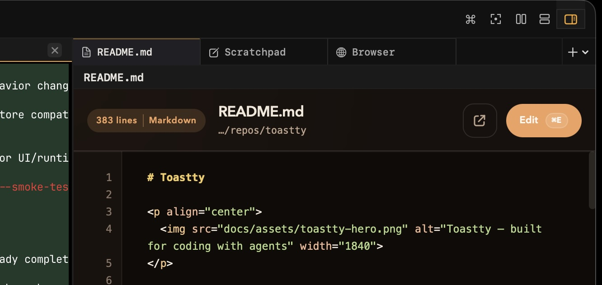
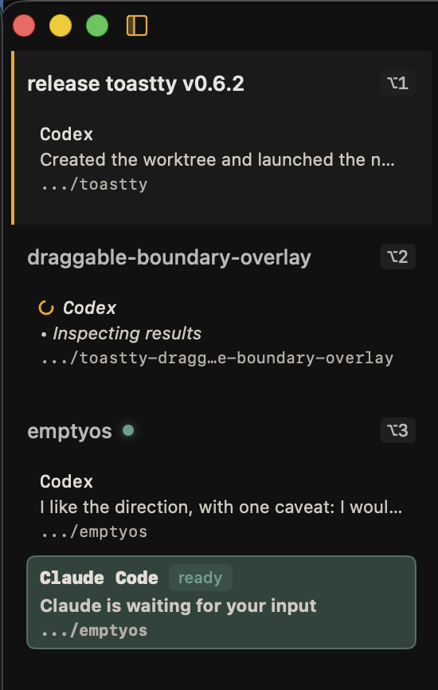

# Toastty

<p align="center">
  
</p>

<p align="center">
  Learn more at <a href="https://toastty.dev"><strong>toastty.dev</strong></a>
</p>

**Toastty is the native macOS home for coding with agents.** Workspaces, live agent status, keyboard-first control, and a right panel for context — all on top of the [libghostty](https://ghostty.org) rendering engine. Your existing Ghostty config just works.

## Getting Started

<p align="center">
  <a href="https://github.com/figelwump/toastty/releases/latest">
    
  </a>
</p>

Requires macOS 14.0+. Download the latest `.dmg` from [GitHub Releases](https://github.com/figelwump/toastty/releases/latest), open it, and drag Toastty to Applications.

For building from source, see [Building and Releasing](docs/building-and-releasing.md).

## Features

### Agents

- **Run agents your usual way** — run CLIs from the command line and Toastty picks up live status automatically for supported agents; or launch from the `Agent` menu, top bar, command palette, or keyboard shortcut
- **Live sidebar status** — working, needs-approval, ready, or error state for Claude, Codex, and Pi sessions
- **Unread badges and notifications** — sidebar badges and macOS notifications when an agent needs you
- **Jump to the next session that needs you** — `Cmd+Shift+A` rotates through unreads, approval/error sessions, then active work
- **Mark a session for later** — `Cmd+Shift+L` flags a managed session; the flag clears automatically when the session meaningfully advances

### Workspaces and layout

- **Workspaces** — named workspaces in the vertical sidebar, drag to reorder, switch with `Option+1`–`Option+9`, persisted across restarts
- **Multi-window** — `Cmd+N` opens a new window with its own sidebar and workspace list
- **Horizontal tabs** — per-workspace tabs with `Cmd+T`, drag to reorder
- **Split panes** — split horizontally (`Cmd+D`) or vertically (`Cmd+Shift+D`), resize (`Cmd+Ctrl+Arrow`), equalize (`Cmd+Ctrl+=`)
- **Command palette** — `Cmd+Shift+P` to run actions, switch workspaces, launch agents, or split with terminal profiles

### Right panel

- **Per-tab Scratchpad, browser, and local-document tabs** — toggle with `Cmd+Shift+B`; each workspace tab keeps its own right-panel tabs
- **Scratchpad** — rich agent-authored notes, plans, and review surfaces in session-linked tabs that persist locally
- **Browser** — built-in browser for docs, dashboards, previews, external handoff, and quick screenshot sharing
- **Local documents** — open Markdown, source files (Swift, JS/TS, Python, Go, Rust, …), configs (YAML, TOML, JSON, dotenv), and data files (CSV, TSV, XML) in editable code views with line numbers; local HTML opens in the browser

### Terminal and content

- **Ghostty rendering** — GPU-accelerated terminal engine with Ghostty config compatibility
- **Focus Mode** — `Cmd+Shift+F` zooms the focused panel to full view to stay in the flow
- **Watch running commands** — `Cmd+Shift+M` gives a busy foreground command a sidebar row, unread badge, and completion notification when it exits
- **In-panel find** — search Ghostty scrollback or the focused local document with `Cmd+F`, navigate with `Cmd+G` and `Cmd+Shift+G`
- **Persisted terminal history** — with shell integration, restored `zsh`/`bash`/`fish` panes keep their own command history, including inside `tmux` or `zmx`
- **Terminal profiles** — launch named setups like `tmux`, `zmx`, or SSH from menu or shortcut ([details](docs/terminal-profiles.md))
- **Text size and zoom** — `Cmd+=`, `Cmd+-`, `Cmd+0` adjust per-panel text size or browser zoom; overrides persist per window or per browser panel
- **Desktop notifications** — from coding agents and other supported processes
- **Automation socket** — JSON-RPC over Unix socket for scripting and external tool integration ([protocol spec](docs/socket-protocol.md))

## Keyboard Shortcuts

| Shortcut | Action |
|---|---|
| `Cmd+N` | New window |
| `Cmd+B` | Show or hide sidebar |
| `Cmd+T` | New tab |
| `Cmd+Shift+B` | Show or hide the right panel |
| `Cmd+Shift+N` | New workspace |
| `Cmd+Shift+E` | Rename workspace |
| `Option+Shift+E` | Rename tab |
| `Cmd+Shift+W` | Close workspace |
| `Cmd+Shift+P` | Open the command palette |
| `Cmd+Ctrl+B` | New browser in the right panel |
| `Cmd+Ctrl+S` | New Scratchpad in the right panel |
| `Cmd+D` | Split horizontally |
| `Cmd+Shift+D` | Split vertically |
| `Cmd+]` | Focus next pane |
| `Cmd+[` | Focus previous pane |
| `Cmd+Shift+A` | Jump to the next session that needs you (unreads, approval/error, then active sessions) |
| `Cmd+Shift+L` | Flag or clear the later flag on the focused managed session |
| `Cmd+Shift+F` | Toggle focused panel (zoom) |
| `Cmd+Shift+M` | Watch the running foreground command in the focused terminal |
| `Cmd+F` | Find in the focused terminal scrollback or local document |
| `Cmd+G` | Find next in the focused terminal scrollback or local document |
| `Cmd+Shift+G` | Find previous in the focused terminal scrollback or local document |
| `Cmd+=` / `Cmd+Shift+=` | Increase the focused panel's text size or zoom |
| `Cmd+-` | Decrease the focused panel's text size or zoom |
| `Cmd+0` | Reset the focused panel's text size or zoom |
| `Cmd+Ctrl+Arrow` | Resize split |
| `Cmd+W` | Close focused panel |
| `Cmd+Ctrl+=` | Equalize splits |
| `Option+1`–`Option+9` | Switch workspace |
| `Cmd+1`–`Cmd+9` | Switch tab |
| `Cmd+Shift+[` | Previous tab |
| `Cmd+Shift+]` | Next tab |
| `Cmd+Ctrl+[` | Previous right-panel tab |
| `Cmd+Ctrl+]` | Next right-panel tab |
| `Option+Shift+[` | Previous tab (wrapping, terminal-proof) |
| `Option+Shift+]` | Next tab (wrapping, terminal-proof) |
| `Option+Shift+1`–`Option+Shift+0` | Focus pane by position |
| `Cmd+Opt+<key>` | Launch agent profile (when profile defines `shortcutKey`) |
| `Cmd+Opt+<key>` / `Cmd+Opt+Shift+<key>` | Profile split right / split down (when profile defines `shortcutKey`) |

`Cmd+W` and `File > Close` use Toastty's panel-close behavior. Dirty local-document drafts ask before discard, local-document saves in progress block destructive close, and the native red close button still asks for confirmation before closing all terminals, tabs, and workspaces in that window.

`Cmd+Q` follows `Toastty > Ask Before Quitting`; when enabled, Toastty warns before quitting if terminal work may still be running or local-document drafts would be discarded, and it blocks destructive quit while a local-document save is still in progress. Choosing `Always quit without asking` in that alert turns the setting off.

For the full shortcut reference grouped by task, see [docs/keyboard-shortcuts.md](docs/keyboard-shortcuts.md).

## Right Panel

<p align="center">
  
</p>

The right panel is a workspace-side tab strip for supporting material that should stay next to the active terminal instead of taking over the main pane layout. Use it for Scratchpad notes, browser panels, and local documents while the main workspace remains focused on terminals and splits.

Each horizontal workspace tab keeps its own right-panel tabs, active tab, width, and visibility in the persisted layout. `Cmd+Shift+B` shows or hides the right panel; when showing it, Toastty focuses the active right-panel tab if one exists. `Cmd+Ctrl+[` and `Cmd+Ctrl+]` cycle through right-panel tabs, `Cmd+Ctrl+B` opens a new browser there, and `Cmd+Ctrl+S` creates a new Scratchpad.

`Cmd+Ctrl+S` starts an unbound manual Scratchpad. Use the binding chip in the Scratchpad header to attach it to an active Toastty-managed agent session in the current tab. After the `toastty-scratchpad` skill is installed for an agent, you can usually skip manual creation and ask the agent for a visual; the agent can create and bind its own Scratchpad on demand.

Browser panel toolbar actions can open the current page in the default browser, copy or save the visible page screenshot, or send a temporary PNG path to an active Toastty-managed agent session in the same workspace tab.

Terminal command-click integrations use the right panel for common supporting files: supported local documents open as editable local-document tabs, and local HTML files open in the browser.

## Running Agents

<p align="center">
  
</p>

Run agents the way you usually do — type `claude`, `codex`, or `pi` in any terminal pane and Toastty's command shims pick up live status automatically. Or launch from the `Agent` menu, the top bar, the command palette, or a keyboard shortcut. Either way, built-in session telemetry drives sidebar status, unread badges, and desktop notifications, and later flags stay attached to the managed session until you clear them or the session advances — no separate agent skill or manual wiring needed.

Use `Cmd+Shift+L` to mark a managed session for later follow-up without pinning it; later-flagged sessions join the active `Cmd+Shift+A` rotation after urgent unread or approval/error work, and the flag clears automatically when the session meaningfully advances.

Use `Cmd+Shift+M` to watch a busy foreground terminal command and get the same sidebar row, unread, and completion-notification affordances for non-agent terminal work. Watched commands are intentionally not later-flaggable.

For full details see [docs/running-agents.md](docs/running-agents.md).

### Agent profiles

Toastty loads launchable agent profiles from `~/.toastty/agents.toml`. Open the file inside Toastty from `Agent > Manage Agents…`, or use the top-bar `Get Started…` button when no agent profiles are configured; Toastty creates a commented template automatically if the file does not exist yet. After editing `agents.toml`, use `Toastty > Reload Configuration` to pick up new buttons and shortcuts without relaunching.

Each profile defines the menu label and the exact command Toastty should launch:

```toml
[codex]
displayName = "Codex"
argv = ["codex"]
shortcutKey = "c"

[claude]
displayName = "Claude Code"
argv = ["claude"]

[pi]
displayName = "Pi"
argv = ["pi"]
```

Configured profiles appear in the `Agent` menu, as top-bar buttons, and in the command palette as `Run Agent: <Display Name>`. `shortcutKey` is optional; when set, Toastty binds `Cmd+Opt+<key>` to launch that profile.

### Profile IDs and special behavior

The TOML table name (the value in `[brackets]`) is the profile's internal ID. Toastty recognizes three well-known IDs that receive first-party instrumentation:

- **`codex`** — Injects Codex session recording, notification hooks, and a log watcher that surfaces live status (working, needs approval, idle) in the sidebar
- **`claude`** — Injects Claude Code lifecycle hooks that report session state back to the sidebar automatically
- **`pi`** — Injects Toastty's bundled Pi extension for session, tool, and changed-file telemetry while preserving user Pi extensions

This matching is keyed on **the profile ID**, not on the command in `argv`:

```toml
[codex]                       # gets Codex instrumentation (ID is "codex")
argv = ["codex"]

[codex]                       # still gets Codex instrumentation
argv = ["/my/codex-wrapper"]  # (ID is "codex", regardless of argv)

[my-codex]                    # no special handling
argv = ["codex"]              # (ID is "my-codex", not "codex")
```

For Pi, Toastty adds its own `--extension <toastty-pi-extension.js>` argument after the actual `pi` executable. User `--extension` arguments remain additive; `pi --no-extensions` or `pi -ne` disables Toastty's injected extension for that launch too. Any other profile ID launches the configured command with base `TOASTTY_*` session context but without agent-specific instrumentation. Custom agents can report status manually via the bundled CLI path exposed in `TOASTTY_CLI_PATH` — see the [full guide](docs/running-agents.md#custom-and-third-party-agents).

## CLI

Toastty bundles a `toastty` CLI for communicating with the running app over its Unix socket. When Toastty launches an agent it injects `TOASTTY_CLI_PATH` into the environment. The CLI handles both session telemetry (`session`, `notify`) and live app control (`action`, `query`).

| Command | Description |
|---|---|
| `action list` | List the live app-control actions exposed by the running app |
| `action run` | Run an app action against a live Toastty instance |
| `notify <title> <body>` | Emit a macOS desktop notification |
| `query list` | List the live read-only app-control queries exposed by the running app |
| `query run` | Run a read-only app query against a live Toastty instance |
| `session start` | Create a new agent session |
| `session status` | Update session state (`idle`, `working`, `needs_approval`, `ready`, `error`) |
| `session update-files` | Report files changed during a session |
| `session stop` | End an active session |

Most flags fall back to `TOASTTY_*` environment variables that Toastty injects automatically, so agents launched from Toastty can often call the CLI with minimal arguments:

```bash
"$TOASTTY_CLI_PATH" session status --session "$TOASTTY_SESSION_ID" --kind working --summary "Thinking"
"$TOASTTY_CLI_PATH" session stop --session "$TOASTTY_SESSION_ID"
"$TOASTTY_CLI_PATH" notify "Done" "Agent finished"
```

For the full command reference including all flags, environment variables, JSON output format, and exit codes, see [docs/cli-reference.md](docs/cli-reference.md).

### Workflow automation with the CLI

The CLI can also drive higher-level workflows against a normal running Toastty instance. This repo's `worktree-create` skill is one example: it resolves the current Toastty window, creates a background workspace, opens `WORKTREE_HANDOFF.md` in a split, and sends the startup command into the new terminal via `query run` and `action run`.

If you want to point an agent at that pattern and have it adapt the workflow for another repo, use this prompt:

```text
Read `.agents/skills/worktree-create/SKILL.md` and `.agents/skills/worktree-create/scripts/open-toastty-worktree-session.sh`, then adapt that workflow for this repo. Reuse the same Toastty CLI pattern: resolve the current window/panel, create a workspace, open a handoff document in a split, and send the startup command into the new terminal.
```

## Configuration

Toastty respects your Ghostty configuration. Config is loaded in this order:

1. `TOASTTY_GHOSTTY_CONFIG_PATH` environment variable
2. `$XDG_CONFIG_HOME/ghostty/config`
3. `~/.config/ghostty/config`
4. Ghostty defaults

Toastty uses `~/.toastty/config` for user-authored defaults and a small amount of macOS `UserDefaults` state for UI behavior. Window-local terminal and local-document text-size overrides, plus per-browser zoom overrides, are persisted with workspace/window layout snapshots instead of rewriting config files.

Use `Toastty > Manage Config…` to open or create the live config file inside Toastty, `Toastty > Open Config Reference…` to inspect the generated commented template inside Toastty, and `Toastty > Reload Configuration` to apply edits without relaunching. `config-reference` is regenerated by Toastty and is reference-only. For the full Toastty-owned config reference, see [docs/configuration.md](docs/configuration.md).

- `terminal-font-size` in `~/.toastty/config` sets the baseline font size Toastty should prefer before any window-local terminal UI override
- `default-terminal-profile` in `~/.toastty/config` applies a profile ID from `~/.toastty/terminal-profiles.toml` to newly created terminals only, including ordinary split shortcuts like `Cmd+D` and `Cmd+Shift+D`
- `enable-agent-command-shims` in `~/.toastty/config` controls whether Toastty prepends managed wrappers into terminal `PATH` so manual built-in agent invocations (`codex`, `claude`, and `pi`) inside Toastty report session status automatically, including configured wrapper executables declared through `manualCommandNames`. Set it to `false` if you do not want Toastty intercepting those commands. Agent menu launches still use their built-in instrumentation.
- the `View` menu uses contextual labels for this shortcut family: focused terminals and local documents show `Increase Text Size`, `Decrease Text Size`, and `Reset Text Size`, while focused browsers show `Zoom In`, `Zoom Out`, and `Actual Size`

Example:

```toml
terminal-font-size = 13
default-terminal-profile = "zmx"
# enable-agent-command-shims = false
```

### Terminal profiles

Terminal profiles are Toastty's way to turn a new pane into a named environment with predictable startup behavior, labeling, and optional split shortcuts. They can be used to run any script at terminal pane startup; for example, run `zmx` or `tmux` for session persistence, `ssh` into a specific remote server, etc.

Features:

- restore the same profile binding after Toastty relaunches and workspace state is reloaded
- open `Split Right` and `Split Down` actions from `Terminal > <Profile Name>`
- bind optional `shortcutKey` values to `Cmd+Opt+<key>` and `Cmd+Opt+Shift+<key>` profile splits
- optionally set a default profile for every new terminal open

Profiles live in `~/.toastty/terminal-profiles.toml` for ordinary runs, or in the active runtime home's `terminal-profiles.toml` when runtime isolation is enabled. Set `TOASTTY_TERMINAL_PROFILES_PATH` if you want Toastty to load another file instead. Each profile defines the menu label, the panel-header badge label, a startup command that Toastty sends to the pane's login shell when the pane is created or restored, and an optional `shortcutKey`.

Use `Terminal > Manage Terminal Profiles…` to open or create the profiles file inside Toastty.

```toml
[zmx]
displayName = "ZMX"
badge = "ZMX"
startupCommand = "zmx attach toastty.$TOASTTY_PANEL_ID"
shortcutKey = "z"
```

The full schema, validation rules, and more examples are in [docs/terminal-profiles.md](docs/terminal-profiles.md).

Toastty sets these environment variables for profiled panes:

- `TOASTTY_PANEL_ID`
- `TOASTTY_TERMINAL_PROFILE_ID`
- `TOASTTY_LAUNCH_REASON` (`create` or `restore`)

Some profiles attach to long-lived shell sessions such as `zmx` or `tmux`.
In that setup, Toastty only sees live pane-title updates if the shell inside
the multiplexer emits title sequences on prompt redraws. See below for
installing the shell integration to do this.

Profile bindings are persisted with the workspace layout, so profiled panes reopen
with the same profile after restart. An example `zmx` profile is included at
[`examples/terminal-profiles/zmx.toml`](examples/terminal-profiles/zmx.toml).
When a profile still exists, the panel-header badge resolves from the live
profile definition.

If you set `default-terminal-profile` in `~/.toastty/config`, Toastty uses that
profile only for new terminals it creates automatically. Existing terminals keep
their current profile bindings.

#### Shell integration

Use `Toastty > Install Shell Integration…` to set up live pane titles and restored-pane command recall for `zsh`, `bash`, and `fish` automatically while preserving shared shell history. The `Get Started…` flow is available both from the empty agent top bar and from `Toastty > Get Started with Toastty…`, where it also offers `agents.toml` setup and the keyboard shortcut reference.

Toastty writes a managed snippet under `~/.toastty/shell/` and adds one
`source` line to the detected shell init file.

When Toastty can resolve the executable path for the live shell running in the
current terminal window and that path maps to `zsh`, `bash`, or `fish`, it
prefers that shell for installation. Otherwise it falls back to `SHELL` for the
current Toastty app launch, then the account login shell from macOS.

- `zsh` → `~/.zshrc`
- `bash` → `~/.bash_profile` by default, or an existing `~/.profile`
- `fish` → `~/.config/fish/config.fish`

After installing, new profiled panes pick it up automatically. Existing `zmx`
or `tmux` sessions may need to restart, or you may need to re-source the init
file inside that session, before live titles update. Restored-pane command
recall only applies to shells launched after Toastty injects the launch
context environment, so older multiplexer sessions usually need a restart.

This journal-based restore path does not migrate old `history/panes/*.history`
files into the new `history/pane-journals/*.journal` format. Existing shared
shell history still remains available immediately, and pane-local recall starts
rebuilding as new commands run in each pane.

For `fish`, Toastty skips pane-journal import and writes when `fish_history=''`.
The first fish slice also mirrors fish's default "leading-space commands stay
out of history" behavior, but it does not currently mirror custom
`fish_should_add_to_history` filters.

Shell integration installation is disabled while runtime isolation is enabled, because sandboxed dev/test runs must not rewrite your login shell files.

For manual dotfile setup, see [docs/shell-integration.md](docs/shell-integration.md).

### Host-side split styling

These keys can be added to your Ghostty config to control how inactive splits appear:

| Key | Description |
|---|---|
| `unfocused-split-opacity` | Alpha value for inactive panes |
| `unfocused-split-fill` | Overlay color for inactive panes (falls back to `background`) |

## Architecture

```
Sources/
├── Core/          # Pure Swift state management (no UI dependencies)
│   ├── AppState, AppReducer, AppAction    # Redux-like state machine
│   ├── WorkspaceSplitTree, LayoutNode     # Binary tree layout engine
│   ├── Sessions/                          # Terminal session registry
│   └── Diagnostics/                       # JSON logging
└── App/           # SwiftUI application layer
    ├── Terminal/   # Ghostty surface hosting, runtime management
    ├── Commands/   # Menu and keyboard shortcut routing
    ├── Automation/ # Unix socket server
    └── Preferences/
```

The `CoreState` framework contains all business logic and state transitions, with no UI dependencies. The `App` layer handles SwiftUI views, Ghostty surface hosting, and system integration.

State flows through a single `AppStore` using a reducer pattern: views dispatch `AppAction`, the `AppReducer` produces new `AppState`, and SwiftUI re-renders.

## Privacy and Local State

Toastty is local-first. The app itself does not send usage analytics or cloud telemetry. The only outbound network connection is Sparkle's update check against `https://updates.toastty.dev/appcast.xml`.

- Toastty writes user-authored config to `~/.toastty/config`, or to `TOASTTY_RUNTIME_HOME/config` for isolated dev/test runs. `TOASTTY_DEV_WORKTREE_ROOT` also enables that isolated runtime-home behavior by deriving a stable sandbox under the worktree.
- Toastty persists window-local sidebar widths, terminal and local-document text-size overrides, plus per-browser zoom overrides in its workspace layout snapshots, or in the active runtime home's snapshot file when runtime isolation is enabled.
- Toastty persists workspace layouts to `~/.toastty/workspace-layout-profiles.json`, or to the active runtime home's `workspace-layout-profiles.json` when runtime isolation is enabled.
- By default, Toastty writes structured logs to `~/Library/Logs/Toastty/toastty.log`, or to the active runtime home's `logs/toastty.log` when runtime isolation is enabled.
- Toastty requests macOS notification permission the first time it tries to deliver a desktop notification.

More detail is in [docs/privacy-and-local-data.md](docs/privacy-and-local-data.md).

## Logging

By default, logs are written to `~/Library/Logs/Toastty/toastty.log` in JSON format and rotate to `toastty.previous.log` at 5 MB. When runtime isolation is enabled, the default log moves to the active runtime home's `logs/toastty.log`.

```bash
tail -f ~/Library/Logs/Toastty/toastty.log | jq
```

| Environment Variable | Description |
|---|---|
| `TOASTTY_LOG_LEVEL` | Log level filter |
| `TOASTTY_LOG_FILE` | Custom log path (`none` to disable) |
| `TOASTTY_LOG_STDERR` | Set to `1` to also log to stderr |
| `TOASTTY_LOG_DISABLE` | Set to `1` to disable logging entirely |

Logs may contain local file paths, config paths, working directories, panel/workspace identifiers, and runtime diagnostics. If you do not want a persistent log file, set `TOASTTY_LOG_FILE=none` or `TOASTTY_LOG_DISABLE=1`.

## Documentation

- [Configuration](docs/configuration.md) — `~/.toastty/config`, `config-reference`, menu actions, and Toastty-owned config keys
- [Running Agents](docs/running-agents.md) — agents.toml configuration, profile IDs, instrumentation, launch flow, and manual integration
- [Keyboard Shortcuts](docs/keyboard-shortcuts.md) — workspace, pane, tab, agent, and profile shortcuts
- [CLI Reference](docs/cli-reference.md) — `toastty` CLI commands, flags, environment variables, and integration examples
- [Building and Releasing](docs/building-and-releasing.md) — build from source, validation, signed DMGs, and GitHub release publishing
- [Ghostty Integration](docs/ghostty-integration.md) — XCFramework setup, config bridging, action parity
- [Environment and Launch Flags](docs/environment-and-build-flags.md) — build toggles, runtime env vars, automation args, and script-level inputs
- [Terminal Profiles](docs/terminal-profiles.md) — `terminal-profiles.toml` schema, shortcuts, and example profile setups
- [Shell Integration](docs/shell-integration.md) — manual shell setup for live pane titles and restored-pane command journals
- [Runtime Sandboxing](docs/runtime-sandboxing.md) — runtime-home strategies, `instance.json`, and cleanup guidance
- [Privacy and Local Data](docs/privacy-and-local-data.md) — local files, permissions, sockets, logging, and Ghostty crash-reporting notes
- [Socket Protocol](docs/socket-protocol.md) — v1.0 JSON-RPC automation protocol
- [State Invariants](docs/state-invariants.md) — AppState correctness rules and validation
