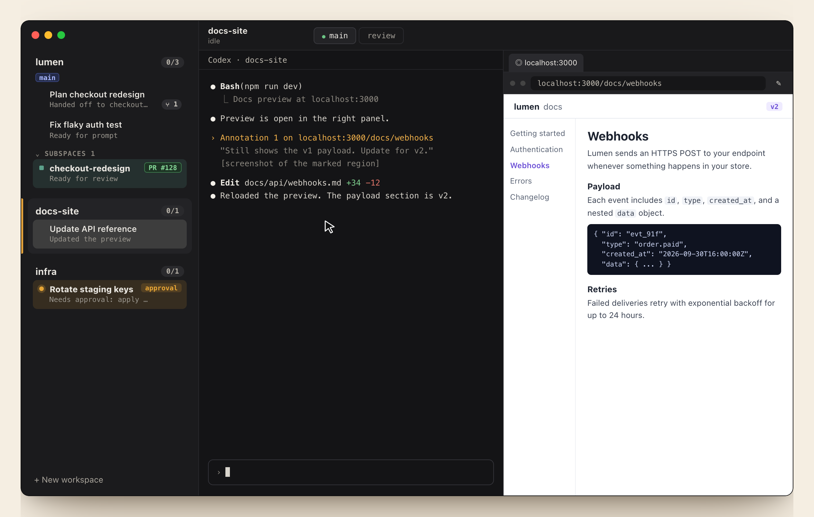
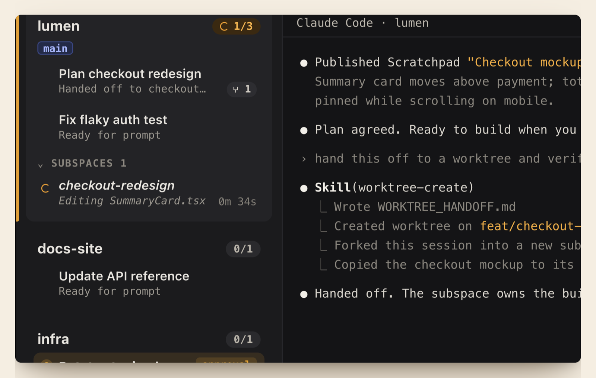
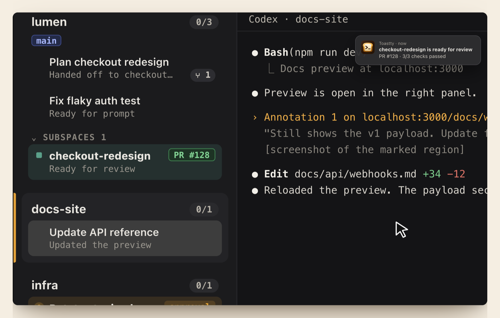
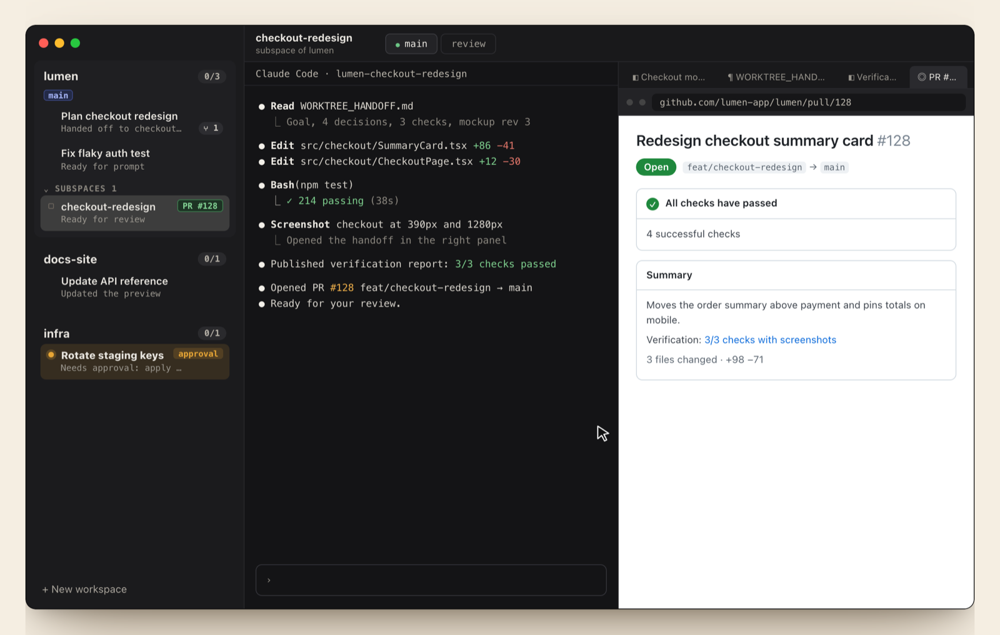
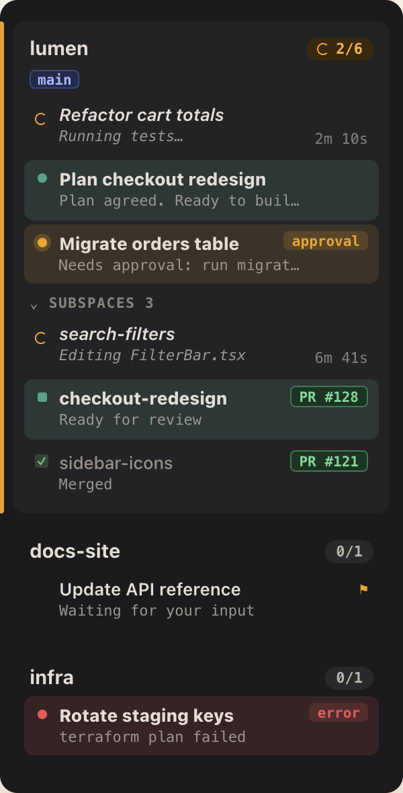
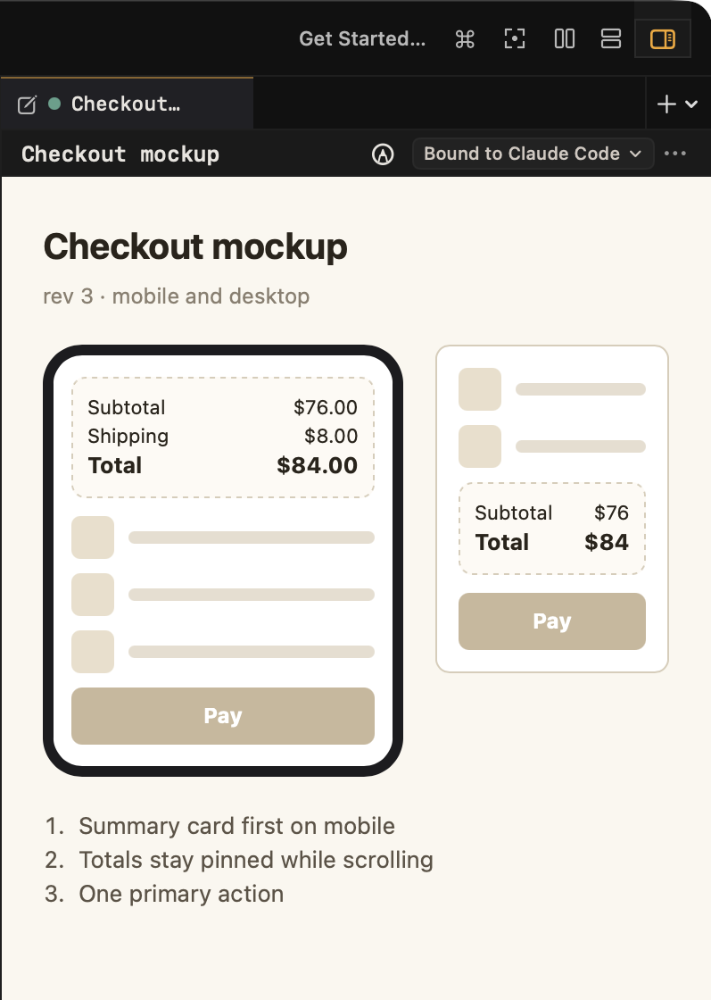
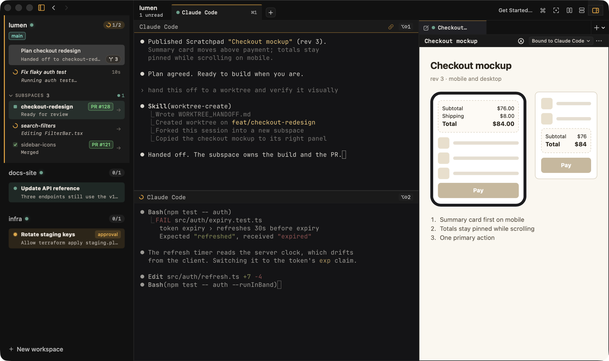
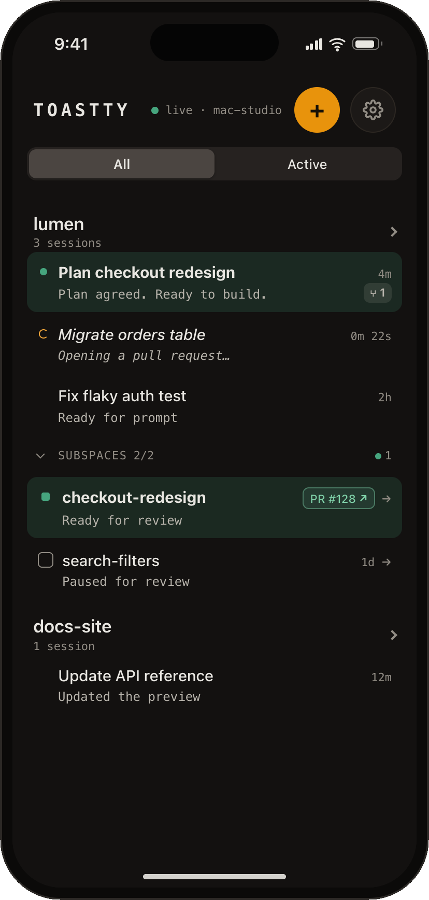

# Toastty

<p align="center">
  <a href="https://toastty.dev">
    
  </a>
</p>

<p align="center">
  <strong>Any agent. Any workflow.</strong><br>
  <a href="https://toastty.dev">Watch the tour on toastty.dev</a>
</p>

Toastty is a native macOS terminal multiplexer for coding agents, built on [Ghostty](https://ghostty.org). It gives your agents building blocks they can drive: workspaces, tabs, splits, a sidebar, and a side panel for docs, webpages, and an HTML scratchpad. Shape them into the workflow that fits how you work, with any agent that runs in a terminal.

<p align="center">
  <a href="https://github.com/figelwump/toastty/releases/latest">
    
  </a>
  <br>
  Requires macOS 14.0+
</p>

## Get started

1. **Download** the latest `.dmg` from [GitHub Releases](https://github.com/figelwump/toastty/releases/latest), open it, and drag Toastty to Applications. Your existing Ghostty config carries over.
2. **Paste the setup prompt** from **Toastty ▸ Get Started with Toastty…** into any agent running in a Toastty pane. It walks the agent through shell integration and status hooks, previewing every change before it writes anything:

   ```text
   You are helping me set up Toastty. Please run:

   "$TOASTTY_CLI_PATH" setup guide

   Read the guide, narrate each step, dry-run every setup installer first (pass --dry-run), show me the planned writes, and wait for my explicit OK before rerunning anything with --apply.
   ```

3. **Pick a workflow.** Copy the [worktree handoff examples](examples/skills/README.md) into `~/.toastty/skills`, or describe how you work and let your agent write a skill there.

To build from source, see [Building and Releasing](docs/building-and-releasing.md).

## What a workflow looks like

<table>
  <tr>
    <td width="33%"></td>
    <td width="33%"></td>
    <td width="33%"></td>
  </tr>
  <tr>
    <td>Hand a task off, and it becomes a subspace. Claude Code and Codex sessions fork the conversation into it.</td>
    <td>Keep working elsewhere. The row turns green when it's ready.</td>
    <td>The handoff, a screenshot report, and the PR are one click away.</td>
  </tr>
</table>

A workflow is a skill in `~/.toastty/skills` that tells your agent which of Toastty's pieces to use and when. Toastty delivers those skills to managed Codex, Claude Code, Cursor, Grok Build, OpenCode, MiMo Code, and Pi launches. The [worktree handoff examples](examples/skills/README.md) (`worktree-create`, `worktree-done`, and `worktree-cleanup`) package a conversation into a new Git worktree and subspace, open the handoff and a verification report beside it, and pin the PR to the sidebar. Other ideas to describe to your agent: start a workspace from a Linear or GitHub issue, open a subspace per PR to review, or split a spec into tasks.

## Features

### Sidebar and agents



- **Live status** for Claude Code, Codex, Cursor, Grok Build, OpenCode, MiMo Code, and Pi. Type `claude`, `codex`, `cursor-agent`, `grok`, `opencode`, `mimo`, or `pi` as usual, or launch from the `Agent` menu, top bar, or command palette. Any other CLI runs in a normal pane.
- **Rows that need you are tinted:** green when ready, amber when waiting for approval, red on an error.
- **Subspaces** nest task workspaces under the session that started them, each with its own status and chips such as `PR #128`.
- Sessions that start their own subagents or background work show them as expandable rows.
- **Jump to what's next:** `Cmd+Shift+A` cycles through unread, approval, and active sessions. `Cmd+Shift+L` marks a session for later; the flag clears when the session moves forward.
- **Watch any command:** `Cmd+Shift+M` gives a long build or test run its own row and a notification when it exits.
- **Unread badges and macOS notifications**, so you can look away.

See [Running Agents](docs/running-agents.md) for agent profiles, instrumentation, and custom agents.

<br clear="right">

### Right panel



- **Scratchpad:** agents publish HTML pages for plans, mockups, diagrams, and reports. A session can bind several Scratchpads and choose which receives commands that do not name a document.
- **Local files:** Markdown, code, configs, logs, and CSV open in an editable view with line numbers.
- **Browser:** previews, dashboards, and PRs beside the terminal.
- **Annotate and send:** mark up a page or Scratchpad and send numbered comments with screenshots to an agent.
- Each tab keeps its own right panel. `Cmd+Shift+B` shows or hides it.

See [Right Panel](docs/right-panel.md) for shortcuts, Recently Opened, and link handling.

<br clear="right">

### Workspaces, tabs, and splits

<p align="center">
  
</p>

- Named workspaces in the sidebar; switch with `Option+1`–`Option+9`. `Cmd+N` opens another window.
- Tabs per workspace (`Cmd+T`) and splits (`Cmd+D`, `Cmd+Shift+D`). `Cmd+Shift+F` zooms the focused panel.
- `Cmd+Shift+P` opens the command palette for actions, workspaces, agents, and files.
- Workspaces, tabs, and splits come back after a restart.

### Terminal

- GPU-accelerated Ghostty rendering; your existing Ghostty config just works.
- [Terminal profiles](docs/terminal-profiles.md): one-key launchers for tmux, zmx, SSH, or any startup command.
- With [shell integration](docs/shell-integration.md), restored panes keep their own command history, including inside tmux and zmx.
- `Cmd+F` finds text in the scrollback or the focused document.

### Toastty Mobile (TestFlight)



The same sidebar, on your iPhone, over your private tailnet.

- **Every session, live:** workspaces and subspaces with the same green, amber, and red tints as on the Mac.
- **Answer your agents' questions:** pick an option or type a custom answer. It lands in the terminal on your Mac as if you were there.
- **Reply from anywhere** with photos and files attached, and watch the tool calls come in.
- **Scratchpads and files:** open the pages, documents, and previews your agents published, and tap a PR chip to read the pull request.
- **Private by design:** Toastty listens only on your Mac, and Tailscale Serve carries the connection over your own tailnet. No Toastty account, no hosted relay.

It is available through TestFlight for now. See it in motion at [toastty.dev/#mobile](https://toastty.dev/#mobile); [Remote Access](docs/remote-access.md) covers pairing and the tailnet setup.

<br clear="right">

## Automate it

Everything above can be driven from scripts and skills through the bundled `toastty` CLI and a local socket. Toastty injects `TOASTTY_CLI_PATH` into every pane it starts:

```bash
"$TOASTTY_CLI_PATH" action run workspace.create title=review activate=false
"$TOASTTY_CLI_PATH" action run panel.create.local-document --workspace "$WS" filePath="$PWD/PLAN.md" placement=rightPanel
"$TOASTTY_CLI_PATH" action run workspace.set-annotation --workspace "$WS" key=github-pr text="PR #128" url="$PR_URL"
```

Run `"$TOASTTY_CLI_PATH" action list` and `query list` to see what the running app supports. See the [CLI reference](docs/cli-reference.md), the [socket protocol](docs/socket-protocol.md), and the [skill examples](examples/skills/README.md).

## Keyboard shortcuts

| Shortcut | Action | Shortcut | Action |
|---|---|---|---|
| `Cmd+Shift+A` | **Jump to the next session that needs you** | `Cmd+Shift+P` | Command palette |
| `Cmd+Shift+L` | Mark a session for later | `Cmd+D` | Split horizontally |
| `Cmd+Shift+B` | Show or hide the right panel | `Cmd+Shift+D` | Split vertically |
| `Cmd+Shift+F` | Zoom the focused panel | `Cmd+T` | New tab |
| `Cmd+Shift+M` | Watch the running command | `Option+1`–`9` | Switch workspace |

See the [full shortcut reference](docs/keyboard-shortcuts.md).

## Configuration

- Ghostty settings come from your Ghostty config.
- Toastty settings: `~/.toastty/config` ([Configuration](docs/configuration.md))
- Agent launchers: `~/.toastty/agents.toml` ([Running Agents](docs/running-agents.md#agentstoml))
- Terminal profiles: `~/.toastty/terminal-profiles.toml` ([Terminal Profiles](docs/terminal-profiles.md))

Use `Toastty > Manage Config…` to edit settings inside Toastty and `Toastty > Reload Configuration` to apply them without relaunching.

## Privacy

Toastty is local-first and sends no usage analytics or telemetry. It checks for updates through Sparkle; other connections come only from features you use, such as Scratchpad web fonts, Remote Access, or a diagnostics report you approve. Logs are written to `~/Library/Logs/Toastty/toastty.log`. See [Privacy and Local Data](docs/privacy-and-local-data.md) for every file and connection Toastty uses and how to turn logging off.

## Documentation

- [Configuration](docs/configuration.md) — `~/.toastty/config`, `config-reference`, menu actions, and Toastty-owned config keys
- [Running Agents](docs/running-agents.md) — agents.toml configuration, profile IDs, instrumentation, skills, worktree tasks, and manual integration
- [Right Panel](docs/right-panel.md) — Scratchpad, browser, and local-document tabs, annotations, and shortcuts
- [Remote Access](docs/remote-access.md) — private tailnet setup, Toastty Mobile pairing, remote replies, and security guidance
- [Agent Hooks](docs/agent-hooks.md) — one global hook script for normalized session lifecycle and status events
- [Keyboard Shortcuts](docs/keyboard-shortcuts.md) — workspace, pane, tab, agent, and profile shortcuts
- [CLI Reference](docs/cli-reference.md) — `toastty` CLI commands, flags, environment variables, and integration examples
- [Building and Releasing](docs/building-and-releasing.md) — build the macOS and iOS apps from source, validate changes, and publish signed releases
- [Architecture Overview](docs/architecture/overview.md) — source layout and how state flows through the app
- [Ghostty Integration](docs/ghostty-integration.md) — XCFramework setup, config bridging, action parity
- [Environment and Launch Flags](docs/environment-and-build-flags.md) — build toggles, runtime env vars, automation args, and script-level inputs
- [Terminal Profiles](docs/terminal-profiles.md) — `terminal-profiles.toml` schema, shortcuts, and example profile setups
- [Shell Integration](docs/shell-integration.md) — manual shell setup for live pane titles and restored-pane command journals
- [Runtime Sandboxing](docs/runtime-sandboxing.md) — runtime-home strategies, `instance.json`, and cleanup guidance
- [Privacy and Local Data](docs/privacy-and-local-data.md) — local files, permissions, sockets, logging, and Ghostty crash-reporting notes
- [Socket Protocol](docs/socket-protocol.md) — v1.0 JSON-RPC automation protocol
- [State Invariants](docs/state-invariants.md) — AppState correctness rules and validation
